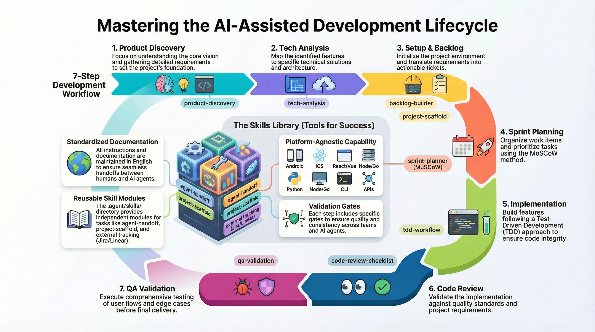

# AI Development Workflow Framework

A comprehensive, platform-agnostic workflow framework for AI-assisted software development. This framework guides Manager Agents and human developers through a structured 7-step process from vision to validation.

## 🎯 Purpose

This is a **process framework**, not a technology framework. It works for any type of project:
- Mobile apps (Android, iOS)
- Web applications (React, Vue, etc.)
- Backend services (Python, Node, Go, etc.)
- Desktop applications
- CLI tools
- APIs

## 📋 Workflow Overview

The framework consists of 7 steps with validation gates:

1. **Product Discovery** — Understand the vision and requirements
2. **Tech Analysis** — Map features to technical solutions
3. **Setup & Backlog** — Initialize project and create tickets
4. **Sprint Planning** — Prioritize and organize work
5. **Implementation** — Build features with TDD
6. **Code Review** — Validate quality and standards
7. **QA Validation** — Test user flows and edge cases

## 🛠️ Skills Library

The `.agent/skills/` directory contains reusable, independent skills:

- **product-discovery** — Structured interviews for product vision
- **tech-analysis** — Feature-to-tech mapping
- **backlog-builder** — Ticket creation from requirements
- **sprint-planner** — MoSCoW prioritization
- **project-scaffold** — Project structure setup
- **tdd-workflow** — Test-driven development guide
- **code-review-checklist** — Quality validation
- **qa-validation** — User flow testing
- **github-flow** — GitHub CLI integration
- **external-tracking** — Jira/Linear/Trello support
- **agent-handoff** — Manager-Worker delegation
- **agent-communication** — Multi-agent coordination via shared board
- **manager-log** — Decision tracking for Manager Agents
- **visual-summary** — ASCII art deliverable summaries

## 🚀 Getting Started

1. Review the workflow: `.agent/workflows/ai-dev-flow-plan.md`
2. Use skills as needed for each step
3. Follow the gates to ensure quality at each phase

## 🧪 Example Implementation In This Repo

This repository now includes a concrete MVP implementation for a bakery order workflow using Google Apps Script:

- Code location: `apps-script/`
- Backend/API: `apps-script/Code.gs`
- Web UI: `apps-script/Index.html`
- Manifest: `apps-script/appsscript.json`
- Setup/deploy notes: `apps-script/README.md`

## 📖 Documentation

All documentation is in English to ensure consistency across teams and AI agents.

## 🤝 Contributing

This framework is designed to evolve. Contributions and improvements are welcome.
